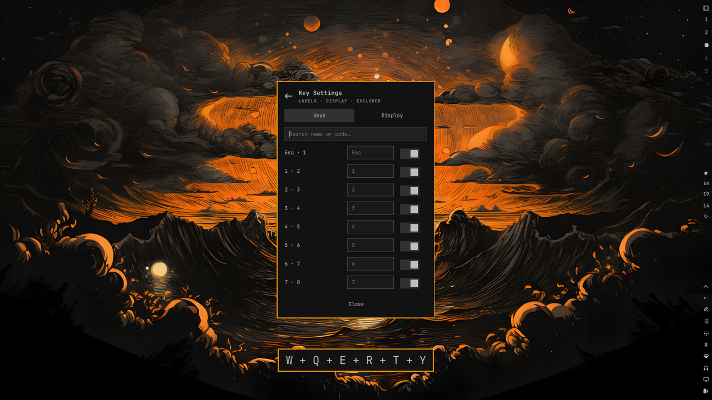

# OmaShowKeys



wshowkeys-style keycast pill for [Omarchy](https://omarchy.org): shows pressed
keys at the bottom center, then fades out.
Theme-aware, bar button with on/off switch, separate key-settings window.

## Install

```bash
omarchy plugin add https://github.com/syaifulmain/omarchy-showkeys.git --enable --yes
```

## Update

```bash
omarchy plugin update syaifulmain.omashowkeys --yes
omarchy-restart-shell
```

## Uninstall

```bash
pkexec ~/.config/omarchy/plugins/syaifulmain.omashowkeys/bin/omashowkeys-revoke
omarchy plugin remove syaifulmain.omashowkeys --yes
```

## Keyboard access

Click the bar button → **Grant keyboard access** → enter your password.
No logout needed. Without it, the popup shows `NO INPUT ACCESS`.

## Settings

```json
{ "id": "syaifulmain.omashowkeys", "enabled": true, "maxKeys": 5, "hideDelayMs": 1000, "scale": 1, "bgMode": "default", "showBorder": true }
```

Popup holds the on/off switch. “Key settings…” opens a tabbed window — Keys (rename + show switch per key, searchable), Display (hide / max keys / size / background / border / position).

## IPC

```bash
omarchy-shell syaifulmain.omashowkeys preview 'Ctrl + Shift + T'
omarchy-shell syaifulmain.omashowkeys flip
omarchy-shell syaifulmain.omashowkeys config
omarchy-shell syaifulmain.omashowkeys tab 1
```

## Credits

- Keycasting lineage: [wshowkeys](https://github.com/ammgws/wshowkeys),
  [screenkey](https://gitlab.com/screenkey/screenkey)
